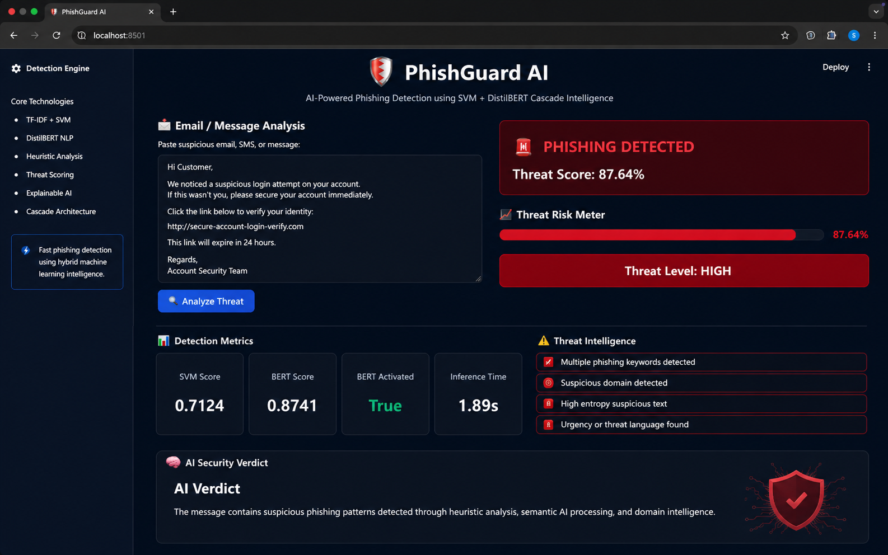
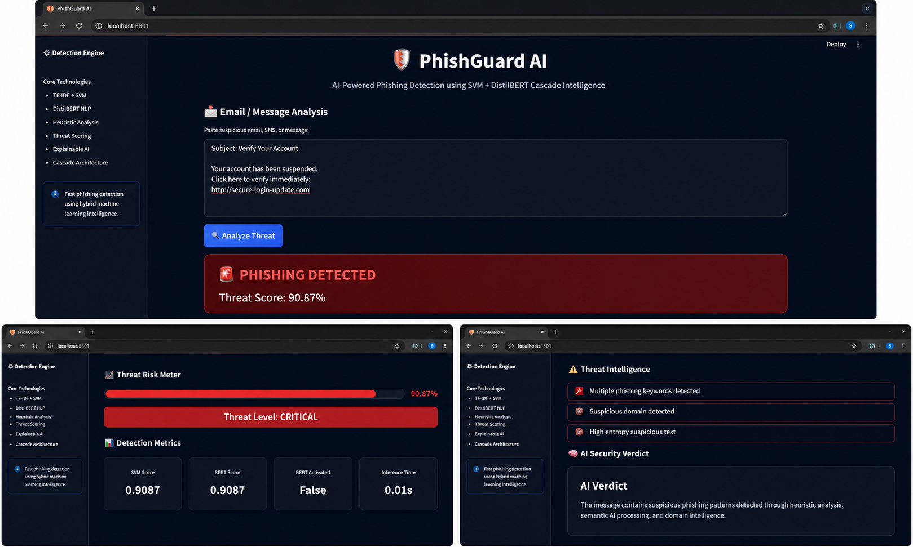
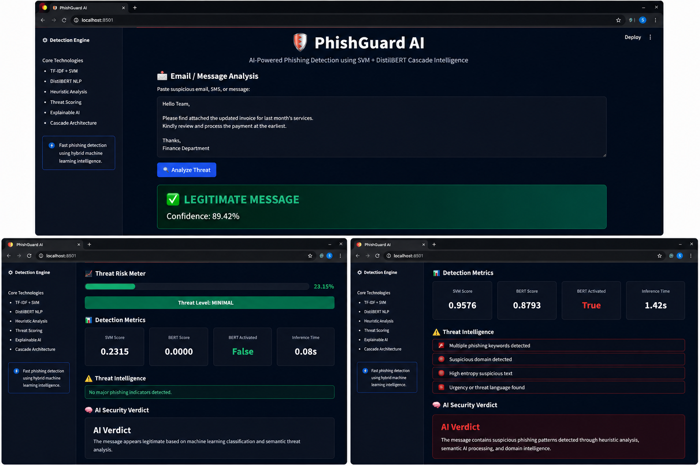

# 🛡️ PhishGuard AI

AI-powered phishing detection platform using TF-IDF, SVM, heuristic threat analysis, and an interactive Streamlit dashboard for real-time email and message security analysis.

---

# 🚀 Live Demo

🔗 https://phishguard-ai-dashboard.streamlit.app/

---

## 🚀 Features

<details>
<summary>📌 Click to Expand Features</summary>

- Real-time phishing email/message detection
- Hybrid phishing analysis pipeline
- Heuristic threat intelligence scoring
- Confidence and risk evaluation
- Interactive Streamlit dashboard
- Fast lightweight inference engine
- URL and suspicious keyword analysis
- Trusted domain verification
- Cybersecurity-focused preprocessing pipeline
- Threat reason explanations

</details>

---

## 🧠 AI Architecture

<details>
<summary>📌 Click to Expand AI Pipeline</summary>

```text
User Input
   ↓
Text Cleaning & Preprocessing
   ↓
TF-IDF Vectorization
   ↓
SVM Threat Classification
   ↓
Heuristic Threat Analysis
   ↓
Threat Intelligence Scoring
   ↓
Final AI Verdict
```

</details>

---

## 📂 Project Structure

<details>
<summary>📌 Click to Expand Project Structure</summary>

```text
phishguard-ai/
│
├── frontend/
├── training/
├── models/
├── datasets/
├── screenshots/
├── requirements.txt
├── README.md
└── .gitignore
```

</details>

---

## 📸 Application Screenshots

<details>
<summary>📌 Click to View Screenshots</summary>

### Dashboard Preview



### Legitimate Message Detection



### Phishing Threat Detection



</details>

---

## 📊 Dataset Information

<details>
<summary>📌 Click to Expand Dataset Details</summary>

The model was trained on a merged phishing and legitimate email dataset containing:

- CEAS_08
- Enron
- Ling
- Nazario
- Nigerian Fraud
- SpamAssassin
- Phishing Email Dataset
- Fraud Email Dataset

### Final Dataset Statistics

- Total Samples: 256,964
- Balanced Classes
- Cleaned & Deduplicated
- Cybersecurity-aware preprocessing pipeline

</details>

---

## ⚙️ Technologies Used

<details>
<summary>📌 Click to Expand Tech Stack</summary>

### Frontend
- Streamlit

### Machine Learning
- Scikit-learn
- TF-IDF
- SVM

### NLP / AI
- Transformers
- DistilBERT
- PyTorch

### Data Processing
- Pandas
- NumPy
- Regex

</details>

---

## 🛠️ Installation

<details>
<summary>📌 Click to Expand Installation Steps</summary>

### Clone Repository

```bash
git clone https://github.com/sumit-jr/phishguard-ai.git
cd phishguard-ai
```

### Create Virtual Environment

```bash
python -m venv venv
```

### Activate Environment

#### macOS/Linux

```bash
source venv/bin/activate
```

#### Windows

```bash
venv\Scripts\activate
```

### Install Dependencies

```bash
pip install -r requirements.txt
```

### Run Application

```bash
streamlit run frontend/app.py
```

</details>

---

## 🧪 Sample Phishing Inputs

<details>
<summary>📌 Click to View Sample Inputs</summary>

### 🚨 Phishing Example

```text
Your bank account has been suspended.
Verify immediately:
http://secure-login-update.com
```

### 🚨 Credential Theft Attempt

```text
Your Office365 password expires today.
Reset now:
http://office365-reset.net
```

### ✅ Legitimate Example

```text
Reminder: Team meeting tomorrow at 10 AM.
Please prepare project updates.
```

</details>

---

## 🎥 Project Demo

<details>
<summary>📌 Click to View Demo Video</summary>

[Watch Project Demo Video](https://drive.google.com/file/d/1Ot6NBG02Sdqt4Nz1tl11VgQeCCWKhHB9/view?usp=sharing)

</details>

---

## 📈 Future Improvements

<details>
<summary>📌 Click to Expand Future Enhancements</summary>

- Real-time URL reputation APIs
- Browser extension integration
- OCR phishing detection
- Email attachment scanning
- Multilingual phishing detection
- Explainable AI dashboard
- Threat intelligence API integration

</details>

---

## 👨‍💻 Author

<details>
<summary>📌 Click to Expand Author Info</summary>

Developed by Sumit Sah

AI + Cybersecurity Enthusiast

</details>

---

## ⭐ Support

<details>
<summary>📌 Click to Expand</summary>

If you found this project useful, consider giving it a ⭐ on GitHub.

</details>
